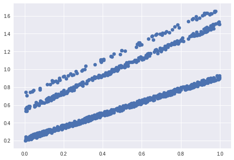
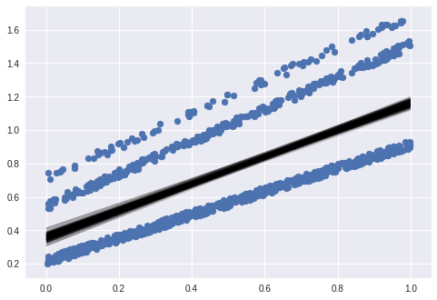
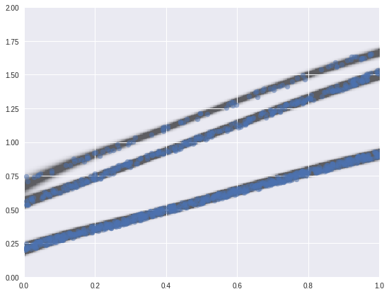

Introduction to PyDelfi
=======================

pydelfi is ...
--------------

PyDelfi is Density Estimation with 
Likelihood-Free Inference in Python. It makes use of
neural density estimators and adaptive acquisition of simulations.

Quick start
-----------

Below we give an example of using a neural density estimator to perform
regression over one independent variable for one dependent variable.
In this example, linear regression and MCMC break down
since our example data clearly has a complex density, and is not
normally distributed about the model.

.. code:: python

   import numpy as np
   import emcee
   from matplotlib import pyplot as plt

Initially, let's show that typical linear regression will fail,
even with MCMC estimation of parameters.
Let's generate three random lines:

.. code:: python

   N = 1000
   xdata = np.random.random(N)

   top_line_frac = 0.3
   mid_line_frac = 0.1
   bot_line_frac = 1-(top_line_frac + mid_line_frac)

   line_choice = np.random.choice(np.arange(3), size=N, p=[top_line_frac, mid_line_frac, bot_line_frac])

   np.random.seed(4)
   line_params = np.random.rand(3, 2)

   noise_param = 0.05
   ydata = line_params[line_choice, 0] * xdata + line_params[line_choice, 1] + noise_param*(np.random.rand(N) - 0.5)

   data = np.array([xdata, ydata]).T

   plt.scatter(xdata, ydata)

Here, the bottom axis is our independent variable and the left
axis is the dependent variable.
Say we want to fit this with least squares regression:

.. code:: python

   def ln_prob_least_squares(x, data):
      m = x[0]
      b = x[1]
      scale = x[2]
      
      if scale <= 0:
        return -np.inf
      
      ytest = m*data[:, 0] + b
      
      return -np.sum((ytest - data[:, 1])**2 / scale**2) - data.shape[0] * np.log(scale)
 
   ndim, nwalkers = 3, 50
   ivar = 1. / np.random.rand(ndim)
   p0 = [np.random.rand(ndim) for i in range(nwalkers)]

   sampler = emcee.EnsembleSampler(nwalkers, ndim, ln_prob_least_squares, args=[data])

   pos, prob, state = sampler.run_mcmc(p0, 100)
   sampler.reset()
   sampler.run_mcmc(pos, 1000);

We have found several potential parameters with MCMC,
where the square error is treated the negative log-likelihood
of a Gaussian (so the line has a Gaussian width).

This finds us the following:

.. code:: python

   m = sampler.flatchain[:, 0]
   b = sampler.flatchain[:, 1]
   s = sampler.flatchain[:, 2]

   plt.scatter(xdata, ydata) 

   np.random.seed(4)
   for i in np.random.randint(0, len(m), 100):
     plt.plot(xdata, m[i]*xdata + b[i], alpha=0.2, color='k')

Now, let's try using pydelfi to get a Gaussian mixture
for each x value.

.. code:: python

   from pydelfi import ndes
   import tensorflow as tf

Let's generate a mixture model with 3 components
and two hidden layers with 30 nodes each,
with tanh activation functions.

.. code:: python

   nde = ndes.ndes.MixtureDensityNetwork(1, 1, 3, [30, 30], [tf.tanh, tf.tanh])
   trainer = ndes.train.ConditionalTrainer(nde)
   sess = tf.Session()
   sess.run(tf.global_variables_initializer())
   train_loss, val_loss = trainer.train(sess, (xdata[:, None], ydata[:, None]))

Now we have our trained model. Let's evaluate it on a grid
and plot the output:

.. code:: python

   x_grid = np.linspace(0, 1, 300)
   y_grid = np.linspace(0, 2, 301)

   x_grid, y_grid = np.meshgrid(x_grid, y_grid)

   x_grid_ = x_grid.ravel()
   y_grid_ = y_grid.ravel()

   density_log = nde.eval((x_grid_[:, None], y_grid_[:, None]), sess)

   plot_data = np.exp(density_log.reshape(301, 300))

   plot_data_rgba = np.ones((301, 300, 4)) * 0.0
   plot_data_rgba[:, :, -1] = plot_data

   plt.figure(figsize=(9, 7))
   plt.scatter(xdata, ydata, alpha=0.5)
   plt.imshow(plot_data_rgba, origin='lower', extent=[0, 1, 0, 2], alpha=0.6, aspect='auto')

This gives us the following regions:

